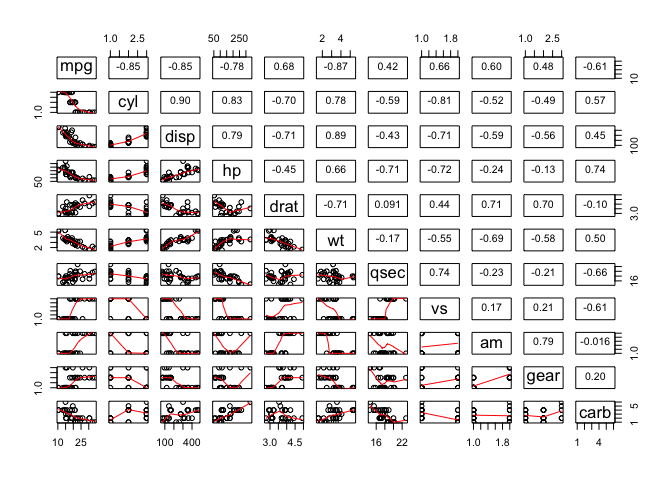

Executive Summary
=================

This project investigates the relationship between MPG (miles per
gallon) and the type of transmission, which could be either Automatic or
Manual. The project starts with exploratory analysis of the data set
mtcars, which belong to 1974 Motor Trend US magazine. Then, statistical
test and regression analysis were performed. T-test showed that Cars
with manual transmission have around 7 MPG more than automatically
transmitted cars. Then, after investigating several linear regression
models, it was found that a model composed of 'wt'(weight), 'qsec' (1/4
mile time), 'am'(Transmission) and an interaction term of wt and am,
achieved the highest adjusted R-squared value and can explain around 88%
of the variance in MPG. Using the aforementioned model, car with manual
transmission has 14.079 - 4.141\*wt more MPG than automatic cars, given
that weight (lb/1000) and qsec (1/4 mile time) are constant. For
example, a car with manual transmission, weighing 1000 lbs, will have
9.938 more MPG than a car with automatic transmission.

Exploratory Data Analyses
=========================

mtcars dataset is a data frame with 32 observations on 11 variables.

Firstly, reading the data and looking at the structure of the data set.
The following numerical variables cyl, vs, am, gear and carb should be
changed to a class of type facor, because they are actually categorical
variabls and not continuous variable.

For readability purposes, the variables 'am' (Transmission Type) is
changed into two levels: Automatic and Manual, instead of the default
values 0 and 1. Also, the variable 'vs' (Engine type) is changed into
two levels: V-engine and Straight-engine, instead of the default values
0 and 1.

Plotting the miles per galon versus the type of transimission (See
Figure 1 in the Appendix), it is obvious that automatic transmission
generally have lower mpg compared to manual. The median of mpg for
automatic transmission is 17.3, while that for manual transmission is
22.8.

To get an idea about variables with a high correlation with mpg, a grid
of plots was built and is shown in Figure 2 in the Appendix. As we can
see, mpg vs am scored a correlation of only 0.6, while variables like
cyl, disp, wt scored a correlation of over 0.8.

Inference
=========

Since the scope of this report is to explore the effect of the type of
transmission on MPG. Our null hypothesis states that MPG data of manual
transmission and automatic transmission are from the same population.

Assuming that data follows a normal distribution and the samples are
randomly distributed, we perform a paired T-test to find out the
p-value:

    ## [1] 0.001373638

    ## mean in group Automatic    mean in group Manual 
    ##                17.14737                24.39231

We reject the null hypothesis, since the p.value is 0.00137. Therefore,
automatic and manual transmission are from different populations.

Model Selection and Analysis
============================

First model
-----------

Our first basic model is to fit all mtcars variables into the model:

    full_model <- lm(mpg~., mtcars)

Analysing this model, we find out that it has a residual standard error
of 2.833 on 15 degrees of freedom. Its adjusted R-squared value is 0.779
which means that 77.9% of the variance in MPG can be explained by this
model. A major downside with this model is that none of the coefficients
are at 0.05 significance level.

Second model
------------

The model here is a simple model composed of only 'am' (transmission
type) as a predicting variable for MPG. This is to explore whether
transmission type only model can explain a lot of the variance in MPG

    am_model <- lm(mpg~am, mtcars)

Analysing this model, we find out that the residual standard error has
risen to 4.902 on 30 degrees of freedom. Its adjusted R-squared value is
0.3385 which means that 33.85% of the variance in MPG can be explained
by this model. However, the coefficients of this model are at 0.05
significance level.

The low adjusted R value indicates that transmission type on its own can
not explain the variance in mpg.

Third model
-----------

Using stepwise regression, which is a method of fitting regression
models in which the choice of predictive variables is carried out by an
automatic procedure. We use Backward elimination which involves starting
with all candidate variables, testing the deletion of each variable
using a chosen model fit criterion, deleting the variable (if any) whose
loss gives the most statistically insignificant deterioration of the
model fit, and repeating this process until no further variables can be
deleted without a statistically significant loss of fit.

    stepwise_model <- step(full_model, direction = "backward", k=log(nrow(mtcars)), trace = FALSE)

Analysing this model, we find out that it is comprised of "mpg ~ wt +
qsec + am". Its residual standard error has fallen to 2.459 on 28
degrees of freedom. Its adjusted R-squared value is 0.8336 which means
that 83.36% of the variance in MPG can be explained by this model. In
addition, all the coefficients of this model are at 0.05 significance
level.

Fourth model
------------

Building upon our third model which achieved a high adjusted R-squared
value with all the coefficients at 0.05 significance level. It is
noticeable to see a high correlation between 'am' and 'wt', which
suggests improving our third model by adding an interaction term between
these two variables. However, with 'qsec', it has a low correlation with
both 'am' and 'wt'.

    improved_stepwise_model <- lm(formula = mpg ~ wt + qsec + am + wt:am, data = mtcars)

Analysing this model, we find out that the residual standard error has
even fallen to 2.084 on 27 degrees of freedom. Its adjusted R-squared
value is 0.8804 which means that 88.04% of the variance in MPG can be
explained by this model. In addition, all the coefficients of this model
are at 0.05 significance level.

<table>
<thead>
<tr class="header">
<th align="left">Model</th>
<th align="right">Adj.r.squared</th>
<th align="right">RSE</th>
</tr>
</thead>
<tbody>
<tr class="odd">
<td align="left">Model 1</td>
<td align="right">0.7790215</td>
<td align="right">2.833169</td>
</tr>
<tr class="even">
<td align="left">Model 2</td>
<td align="right">0.3384589</td>
<td align="right">4.902029</td>
</tr>
<tr class="odd">
<td align="left">Model 3</td>
<td align="right">0.8335561</td>
<td align="right">2.458846</td>
</tr>
<tr class="even">
<td align="left">Model 4</td>
<td align="right">0.8804219</td>
<td align="right">2.084122</td>
</tr>
</tbody>
</table>

From the table above, we see that Model 4 achieved the highest adjusted
R-squared values and the lowest residual standard error with all the
coefficients are at 0.05 significance level.

Model 4 (See "Model 4 Summary in the Appendix") indicates that a car
with manual transmission has 14.079 - 4.141\*wt more MPG than automatic
cars, given that weight (lb/1000) and qsec (1/4 mile time) are constant.
For example, a car with manual transmission, weighing 1000 lbs, will
have 9.938 more MPG than a car with automatic transmission.

Residuals and Diagnostics
=========================

The residual plots are shown in Figure 3 in the Appendix, from these
plots we can infer the following:

1.  The Residuals vs. Fitted plot shows that points are randomy
    scattered, supporting the accuracy of the independence assumption.
2.  The Normal Q‑Q plot indicates that the residuals are normally
    distributed because the points lie closely to the line.
3.  The Scale‑Location plot confirms the constant variance assumption,
    as the points are randomly distributed.
4.  The Residuals vs. Leverage shows that no outliers or influential
    points are present, because all cases are well inside of the Cook’s
    distance lines( red dashed 0.5 bands).

Appendix
========

Figure 1: MPG vs Type of Transmission
-------------------------------------


Figure 2: Grid of pair plots of correlation between variables of 'mtcars'
-------------------------------------------------------------------------



Figure 3: Residual Plots
------------------------


Model 4 Summary
---------------

    ## 
    ## Call:
    ## lm(formula = mpg ~ wt + qsec + am + wt:am, data = mtcars)
    ## 
    ## Residuals:
    ##     Min      1Q  Median      3Q     Max 
    ## -3.5076 -1.3801 -0.5588  1.0630  4.3684 
    ## 
    ## Coefficients:
    ##             Estimate Std. Error t value Pr(>|t|)    
    ## (Intercept)    9.723      5.899   1.648 0.110893    
    ## wt            -2.937      0.666  -4.409 0.000149 ***
    ## qsec           1.017      0.252   4.035 0.000403 ***
    ## amManual      14.079      3.435   4.099 0.000341 ***
    ## wt:amManual   -4.141      1.197  -3.460 0.001809 ** 
    ## ---
    ## Signif. codes:  0 '***' 0.001 '**' 0.01 '*' 0.05 '.' 0.1 ' ' 1
    ## 
    ## Residual standard error: 2.084 on 27 degrees of freedom
    ## Multiple R-squared:  0.8959, Adjusted R-squared:  0.8804 
    ## F-statistic: 58.06 on 4 and 27 DF,  p-value: 7.168e-13

<!-- #Conclusion -->
<!-- ```{r, echo=TRUE, message=FALSE, warning=FALSE} -->
<!-- library(ggplot2) -->
<!-- library(dplyr) -->
<!-- str(mtcars) -->
<!-- summary(mtcars) -->
<!-- head(mtcars) -->
<!-- mtcars_dt <- mtcars -->
<!-- mtcars_dt$cyl <- factor(mtcars$cyl) -->
<!-- mtcars_dt$vs <- factor(mtcars$vs) -->
<!-- mtcars_dt$am <- factor(mtcars$am) -->
<!-- mtcars_dt$gear <- factor(mtcars$gear) -->
<!-- mtcars_dt$carb <- factor(mtcars$carb) -->
<!-- levels(mtcars_dt$am) <- c("Automatic", "Manual") -->
<!-- levels(mtcars_dt$vs) <- c("V-engine", "Straight-engine") -->
<!-- model3 <- lm(formula = mpg ~ wt + qsec +gear+ am +wt:qsec+ wt:am +gear:wt, data = mtcars) -->
<!-- summary(model3) -->
<!-- plot1 <- ggplot(mtcars_dt, aes(x= cyl, y= mpg, fill = cyl)) + geom_boxplot() + facet_grid(.~mtcars_dt$am) + ggtitle("MPG vs Number of Cylinder") + labs(fill = 'Number of Cylinders') + -->
<!--     xlab('Number of Cylinders') + -->
<!--     ylab('Miles /(US) gallon') -->
<!-- plot2<-  ggplot(mtcars_dt, aes(x= disp, y= mpg,col= cyl) ) + geom_point() + facet_grid(.~mtcars_dt$am) + ggtitle("MPG vs Displacement") + labs(col = 'Number of Cylinders') + -->
<!--     xlab('Displacement') + -->
<!--     ylab('Miles /(US) gallon') -->
<!-- plot3<-  ggplot(mtcars_dt, aes(x= hp, y= mpg,col= vs) ) + geom_point() + facet_grid(.~mtcars_dt$am) + ggtitle("MPG vs Horsepower") + labs(col = 'V-engine / S-engine') + -->
<!--     xlab('Horsepower (hp)') + -->
<!--     ylab('Miles /(US) gallon') -->
<!-- plot4<-  ggplot(mtcars_dt, aes(x= wt, y= mpg,col= gear) ) + geom_point() + facet_grid(.~mtcars_dt$am) + ggtitle("MPG vs Weight") + labs(col = 'Gear') + -->
<!--     xlab('Weight') + -->
<!--     ylab('Miles /(US) gallon') -->
<!-- ``` -->
<!-- colorful plot for all variables using ggpairs: -->
<!-- mtcarsFactors[,subsetColumns] %>% -->
<!--     ggpairs( -->
<!--         mapping = ggplot2::aes(color = am), -->
<!--         upper = list(continuous = wrap("cor", size = 3)), -->
<!--         lower = list(continuous = wrap("smooth", alpha=0.4, size=1), combo = wrap("dot")) -->
<!--     ) -->
